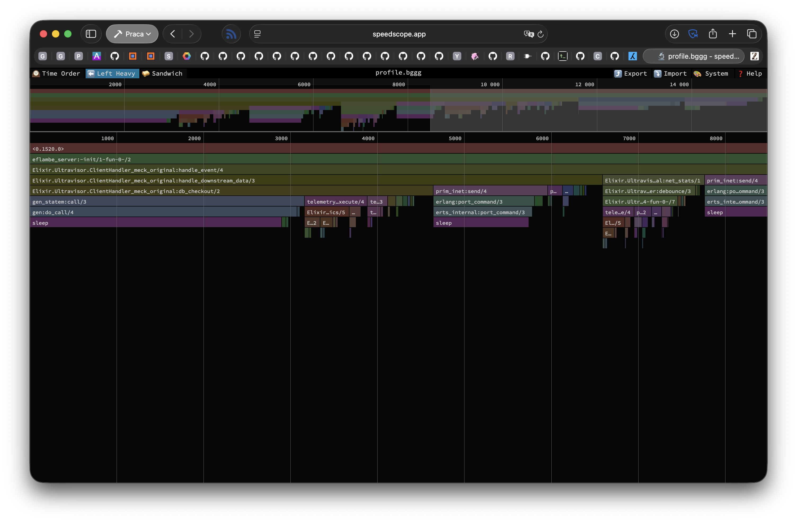
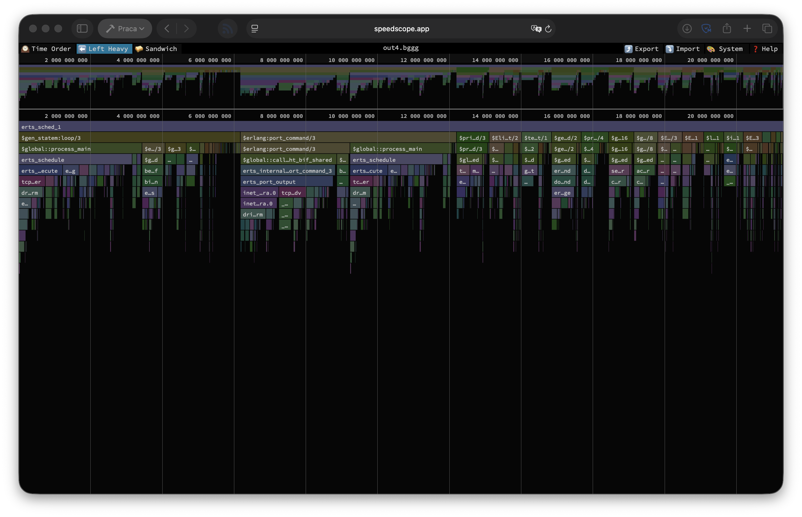

+++
date = 2026-04-20
title = "Scotty, I need warp speed in three minutes"

description = """
My journey into optimising Elixir codebase of Ultravisor (my fork of Supabase's
Supavisor).

This story is not about a goal, but ~~friends~~ optimisations we met along the
way.
"""

[taxonomies]
tags = [
    "beam",
    "performance"
]
+++

In my last larger gig I worked on fascinating project - [Postgres connection
pooler written in Elixir][supavisor]. Unfortunately, due to different
circumstances, this project burned me out to the ground. However what doesn't
kill you ~~is crap not a weapon~~ can become great learning experience.

[supavisor]: https://github.com/supabase/supavisor

Most of my achievements in this project were related to performance. This
project contains **very** tight loop in form of query handler, that needed to
run hundreds of thousands times per second per user connection. That mean that
this functions are *very* sensitive to even slightest performance changes. And
that was my task - to find potential improvements that can be made to make this
codebase be much faster.

After departing from Supabase I liked the project so much (mostly as learning
ground) that I have created my own fork, where unrestrained from all business
side of the project I could focus purely on squeezing as much of performance as
I can. This project now lives as [Ultravisor][] - it is still nowhere near being
done in a way that I like, but I still go back to work on it from time to time
to find potential performance improvements.

This is a story of things that I have done and learned during that journey.

> **Beware**: It is a retrospection, so in some places my memory may be not the
> best.

Here I need to provide some explanation first, about how Ultravisor works with
database connections. It provides 2 modes of operation:

- `session` - where each connection from user to Ultravisor checks out one
  connection from Ultravisor to database. It checks out once, at the start
  of connection, and then holds connection until the end;
- `transaction` - where on connection there is nothing done. Client connects to
  the Ultravisor and can keep that connection indefinitely without ever
  bothering database. Database connection is checked out *only* when there is
  some request from user and is returned to the pool as soon as that result of
  that query is returned and DB is ready for next one.

While `session` mode is quite on par with other implementations of connection
pooling for Postgres, `transaction` mode is where performance is lacking and is
the main focus is put. In whole article (unless mentioned otherwise) I will
speak about `transaction` mode of Ultravisor.

## Lesson: Flame graphs and call tracing is essential

Pretty obvious thing, but still valuable lesson for any performance
optimisation endeavour. For that the great thanks to [Trevor Brown][Stratus3D]
and his awesome project [eFlambè][eflambe]. This helped a lot in tracing hot
points in the running code.

Unfortunately this project seems to be less active recently and has some missing
features, like [listening for given duration instead of function calls
count](https://github.com/Stratus3D/eflambe/issues/48). This can be partially
fixed by simply listening for count of calls to `handle_event/4` function given
times and then running `cat *.bggg` to concatenate all files into larger trace.
That has disadvantages, but at least it was workable within [Speedoscope][]
which I also highly recommend to anyone who needs to work on such optimisation.

While flame graphs are awesome, there is cost to gathering them with eFlambè -
it greatly affects performance. Fortunately Erlang has some built in tools that
have lesser performance impact, and the "most modern" of these is
[`tprof`][tprof]. This tool is pretty easy to use, but is less detailed than
eFlambè. But even with that limitation, it provides superb insight into stuff
that has greatest impact on performance, as well as it make it easier to work on
long running processes, as it work asynchronously, so you can "manually" decide
how long you want to trace your process.

[Stratus3D]: https://github.com/Stratus3D
[eflambe]: https://github.com/Stratus3D/eflambe
[tprof]: https://erlang.org/doc/man/tprof.html

**Summary:** Knowing where your bottlenecks are is essential for performance
optimisations.

## Lesson: Doing less can improve performance

Obvious thing that need to be stated - doing nothing is faster than doing
something. Extracting amount of data sent over given socket using
`:inet.getstat/2` call is fast, but not free. That involves some waiting for
response from either port or process handling connection, which introduces
slowdown. Two possible solutions there are:

1. Do not gather that metric at all - sensible, but not feasible, especially when
   you use that metric to charge your users.
1. Gather that data less often.

The approach I have taken there is obviously 1., and the solution is dumb
simple - debouncer.

Debouncing is an interesting technique often used in user interfaces where you
accept some event, and then for some period you ignore repeated events. The
reason for that is that our interfaces may have flaws that send repeated events
one after another.

In this case Ultravisor tries to store amount of sent data after each query, but
that can get expensive for many short queries. Instead I have implemented simple
per-process debouncer:

```elixir
defmodule Ultravisor.Debouncer do
  def debounce(key, time \\ 100, func) do
    current = System.monotonic_time(:millisecond)
    key = {:debounce, key}

    case Process.get(key, nil) do
      {prev, ret} when prev + time > current ->
        ret

      _ ->
        ret = func.()
        Process.put(key, {current, ret})
        ret
    end
  end
end
```

This stores returned data in process dictionary (per-process mutable space with
quick access) and if there was no call in given time-period, then we process
data again. This is safe way to do so, as `:inet.getstat/2` will always return
amount of data that socket processed since it started, so data between calls
will be accounted.

Before:
```
tps = 79401.392762 (without initial connection time)
```

After (10ms of debouncing):
```
tps = 80069.646510 (without initial connection time)
```

After (100ms of debouncing):
```
tps = 80568.825937 (without initial connection time)
```

**Summary**: Doing noting is more performant than doing something. Sometimes
doing nothing can be quite easy.

## Lesson: Telemetry is not free

When working on most projects, especially Phoenix-based, one can slap
`:telemetry.execute/3` calls everywhere and notice no performance degradation[^telemetry].
Unfortunately, when you do hundreds of thousands calls a second - that is not a
case.

[^telemetry]: For unaware readers - [Telemetry][] is Erlang event dispatching
    system for observability events.

[Telemetry]: https://github.com/beam-telemetry/telemetry

In this project the metrics are exposed in Prometheus/OpenMetrics format, which
mean that there need to be collection system within application. In BEAM
applications the standard way to implement that is to use ETS tables to store
recorded values. Fortunately there are libraries to handle that for you, and for
the longest time "gold standard" for it was `telemetry_prometheus_core` library
created by Telemetry core team.

While for most projects that library is performant enough (because metrics
aren't recorded in quite tight loops), in case of this project that was not a
case. There, metrics gathering is still one of the hottest spot in the codebase,
even with all improvements that have been done.

Excerpt from `tprof` profile:

| Function                             | Calls count | Per call (μs) | Percentage |
| -                                    | -          :| -            :| -         :|
| `Peep.EventHandler.store_metrics/5`    | 1421911     | 0.13          | 4.21%      |
| `Peep.Storage.Striped.insert_metric/5` | 904852      | 0.26          | 5.11%      |

This is with awesome library [Peep][] by [Richard Kallos][rkallos]. When using
`telemetry_prometheus_core` it was simply the most expensive thing in whole
loop. Just replacing metrics gathering library with Peep gave us about 2x bump
in TPS.

[Peep]: https://github.com/rkallos/peep
[rkallos]: https://github.com/rkallos

**Summary:** Telemetry handler can matter in tight loops. Fast metrics gathering
isn't easy.

## Lesson: Records instead of maps or structs

Elixir uses structs for structured data. That gives a lot nice features wrt. hot
code reloads, compilation graph dependencies, and other. However, because
structs are maps, there is a cost. Maps have O(log n) access time to the fields,
this is how maps are constructed in memory. While smaller maps have slightly
different (better in most cases) characteristics, there is strict requirement
that you keep your structure with less than 31 fields[^fields] and it still has
slight memory overhead. The alternative is to use [records][]. These have better
performance characteristic (always constant) irrelevant of the amount of fields
at the cost of being slightly more rigid (records are tuple based) and less
convenient to use (experience may vary). Additional advantage in my opinion is
that it is harder to add incorrect field by using `Map` module.

[^fields]: Current (OTP 28) limit for small map is 32 keys, but Elixir uses one
    key for struct name, hence 31 fields is the limit.

Before you will run and change all structs in your system to records, just
remember - most of the time the difference doesn't matter - just use structures.

[HAMT]: https://en.wikipedia.org/wiki/Hash_array_mapped_trie
[records]: https://hexdocs.pm/elixir/Record.html

Before:
```
tps = 81765.266264 (without initial connection time)
```

After:
```
tps = 82147.855889 (without initial connection time)
```

**Summary:** `Record`s are super handy when you need to squeeze each bit of
performance. It doesn't provide much, but these adds up.

## Lesson: ETS tables are super fast, but not always

[ETS][] is Erlang's built-in module for storing key-value data in mutable way.
Like built-in Redis. This structure allows for sharing some data in a way, that
is easy to access from different parts of the system. One example of system that
is using ETS for storing their information is Telemetry (mentioned above).

While for 99% of the use cases Telemetry will be fast enough, it has some
problems with tight loops. Main problem is that it will always copy data from
table to the caller process. That mean that it can put high memory pressure on
the process that tries to retrieve data.

Fortunately Erlang supports another mechanism for storing globally accessible
data - `persistent_term`. Of course, there is no such thing as "free lunch" so
it has substantial disadvantage - it works poorly[^pt] with data that changes
often, as removing or changing data in a key will require walk through all
processes to copy data from it to processes that may use it into process memory.
However - Telemetry handlers should not change a lot, you should just set them
once as soon as your system start, and then ideally they will not change ever
again.

[^pt]: There is slight optimisation that makes it fast in some cases (single
    word values, like atoms), but that is not the case there, so we can ignore
    that.

Before[^lower-tps]:
```
tps = 76914.004685 (without initial connection time)
```

After:
```
tps = 78479.006634 (without initial connection time)
```

[^lower-tps]: If you wonder why these results are lower than in previous
    section, it is because test conditions are identical only per section, not
    cross sections. In this particular case I have ran benchmark while
    collecting metrics (to show difference in `persistent_term` change) while
    other are ran without metrics to not pollute results.

**Summary:** `persistent_term` is awesome and super fast, so if you know that
you have some data that will probably never change and will be requested
*constantly*, then it may be good place to store that data.

[ETS]: https://www.erlang.org/doc/apps/stdlib/ets.html

## Lesson: Calling your `GenServer`s is fast, but not 90k times per second fast

One of the interesting observations is that I have spotted is that if there are
longer running queries, one that send more data over the network than just
simple short response, then the difference between Ultravisor and "state of the
art" tools like [PgBouncer][] or [PgDog][] (that are written in non-managed
languages like C and Rust) is much smaller (obviously it is still there, but it
is on par, not substantially off).

[PgBouncer]: https://www.pgbouncer.org
[PgDog]: https://pgdog.dev

I needed to dig more, what can be the cause of such strange behaviour. The
reason was found in place where I least expected it - checking out database
connection to be used.

Flame graph showed that almost third of the time is spent on checking out
database connections, and most of that time is spent in 2 function calls, both
of them are internally `gen_statem` calls and in both most time is spent on
sleeping (aka, waiting for reply).



Now, this one is hard thing to optimise, as in Elixir there is no mutability
(almost, we will get there). This mean that if I want some form of shared queue
of processes, then I need to use separate process to keep state of the queue
for us, and then do `GenServer` calls to fetch that state. What I did in such
situation? What any unreasonable Elixir developer obsessed with performance
would do - NIF[^ets].

[^ets]: I wanted to use ETS there, but for that to work it lacks function like
    `ets:take/2` that would return only one element from the tables with type
    `bag` or `duplicate_bag`. Or any other form of just taking out any (possibly
    random) element from ETS table in atomic way.

The implementation is rather basic wrapper over [`VecDeque`s][rust::VecDeque]
that allow popping single element from that queue without any message passing.
The implementation is very crude, nowhere production ready. It doesn't provide
any form of worker restarts or anything, but works quite well as PoC of what is
possible.

New queue also provides a way to store additional "metadata" alongside the
worker PID. This allows me to store DB connection socket next to connection
process, which removes need for additional call to extract that data to pass
requests directly to other DB, without copying data between processes.

[rust::VecDeque]: https://doc.rust-lang.org/1.94.0/std/collections/struct.VecDeque.html

Before:
```
tps = 83619.640673 (without initial connection time)
```

After:
```
tps = 94191.475386 (without initial connection time)
```

**Summary:** Sometimes one need to get creative to get around platform
limitations. This may require some pesky NIFs though.

## Conclusions

Optimising such project was enormous fun and I think that at the current state
there is nothing extra that can be done to optimise it more without optimising
generated JIT-ed native code or optimising Erlang scheduler.



There are some flags, that affect performance, but as it is currently unclear
why these work at all (probably it is related more to the OS scheduler rather
than Erlang performance), I left them out of this article for now.

## Post Scriptum: Good tooling helps a lot

Just after I have started that optimisation project after leaving Supabase I
started using [Jujutsu][jj] for version control. That one thing helped me **a
lot** with being able to have separate branches/PRs for each of the changes,
while at the same being able to work with [mega-merge][jj-mm] of them all.

That allows me to profile code with all other noise removed, while still
exposing the changes as separate reviewable units. Without that support I would
need to decipher what have already been changed and/or removed from the profile.

Additional feature that I heavily used there is "anonymous branching". As when
working with JJ I do not need to create new name for each branch that I want to
try, it was way easier to implement one idea, then just do `jj new @-` (which
branches off at the commit that is parent of the current one) and just implement
alternative idea. I used that constantly to compare ideas and reject failed
concepts.

[jj]: https://docs.jj-vcs.dev/latest/
[jj-mm]: https://steveklabnik.github.io/jujutsu-tutorial/advanced/simultaneous-edits.html
